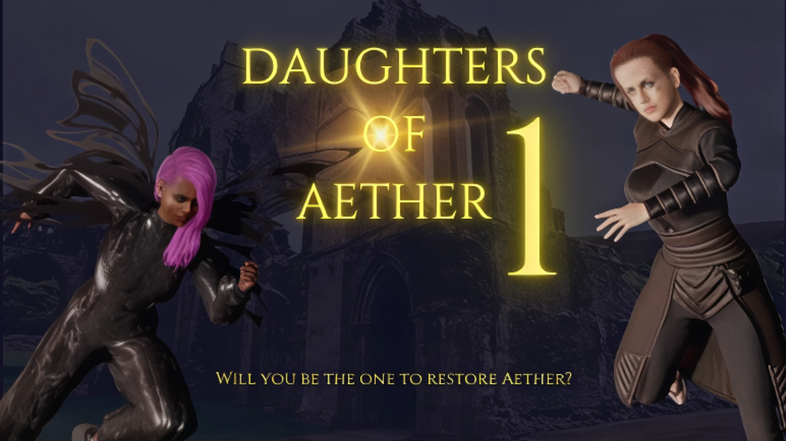

# Daughters of Aether

**A real-time Web3 PvP arena game on Gorbagana testnet**

Daughters of Aether is a fast-paced, competitive multiplayer game that demonstrates Gorbagana's speed and fairness through engaging PvP battles. Players select unique 3D characters, stake GOR tokens, and battle in real-time for glory and rewards—all settled transparently on the Gorbagana testnet.

## 🎮 Game Overview

### Core Gameplay
- **Real-time PvP Battles**: Fast-paced 3D arena combat with health, mana, and special moves
- **Character Selection**: Choose from unique heroines with distinct elemental powers
- **Token Staking**: Stake GOR tokens to enter battles—winner takes all
- **Instant Matchmaking**: Real-time player pairing via Socket.IO
- **On-chain Resolution**: Every battle result is settled transparently on Gorbagana

### Why It's Perfect for Gorbagana
- **Zero-MEV Execution**: Fair, transparent battles with no front-running
- **Instant Finality**: Real-time gameplay with immediate on-chain settlement
- **Web2-like Speed**: Seamless multiplayer experience powered by Gorbagana's performance
- **Community-Driven**: Built by degens, for degens—embracing the "trash chain" spirit

## 🚀 Gorbagana Integration

### Smart Contract Details
- **Program ID**: `GAB3CVmCbarpepefKNFEGEUGw6RzcMx9LSGER2Hg3FU2`
- **Network**: Gorbagana testnet
- **Native Token**: GOR (for staking and rewards)
- **Explorer**: [Gorbagana Explorer](https://explorer.gorbagana.wtf/)

### Technical Implementation
- **Solana Program**: Anchor-based smart contract for battles, staking, and resolution
- **Real-time State**: Socket.IO server handles matchmaking and battle coordination
- **Wallet Integration**: Seamless Backpack wallet support with Gorbagana RPC
- **Dynamic Configuration**: Automatically adapts to Gorbagana network settings

### Token Usage
- **Staking**: Players stake GOR tokens to enter battles
- **Rewards**: Winner receives the total stake pool
- **Fees**: Minimal transaction fees for battle resolution
- **Access Control**: Token-gated character selection and arena access

## 🎯 Features

- **Wallet Connection**: Seamless Backpack wallet integration
- **Character Selection**: 3D character previews with elemental themes
- **Real-time Matchmaking**: Instant player pairing via Socket.IO
- **Battle Arena**: 3D real-time combat with health, mana, and animations
- **Battle Resolution**: Victory, defeat, tie, forfeit, and disconnect handling
- **Transaction Feedback**: Real-time status updates and error handling
- **Dynamic Environment**: Automatic RPC and program ID selection

## 🛠️ Getting Started

### Prerequisites
- Node.js 18+ and pnpm
- Backpack wallet (configured for Gorbagana testnet)
- GOR testnet tokens (get from [Faucet](https://faucet.gorbagana.wtf))

### Installation

#### Quick Install

**Linux:**
```bash
curl -L https://raw.githubusercontent.com/DavidNzube101/DOA-Launcher/master/releases/DOA-Launcher-linux-amd64 -o doa-launcher && chmod +x doa-launcher && sudo mv doa-launcher /usr/local/bin/
```

**macOS:**
```bash
curl -L https://raw.githubusercontent.com/DavidNzube101/DOA-Launcher/master/releases/DOA-Launcher-darwin-amd64 -o doa-launcher && chmod +x doa-launcher && sudo mv doa-launcher /usr/local/bin/
```

**Windows (PowerShell):**
```powershell
Invoke-WebRequest -Uri "https://raw.githubusercontent.com/DavidNzube101/DOA-Launcher/master/releases/DOA-Launcher-windows-amd64.exe" -OutFile "doa-launcher.exe"
```

#### Manual Download
1. Go to the [releases folder](https://github.com/DavidNzube101/DOA-Launcher/tree/master/releases)
2. Download the appropriate binary for your platform:
   - **Linux**: `DOA-Launcher-linux-amd64`
   - **macOS**: `DOA-Launcher-darwin-amd64`  
   - **Windows**: `DOA-Launcher-windows-amd64.exe`
3. Make it executable (Linux/macOS): `chmod +x DOA-Launcher-*`
4. Move to your PATH: `sudo mv DOA-Launcher-* /usr/local/bin/doa-launcher`

#### Usage

   Just run 
```bash
doa-launcher
```

### How to Play

1. **Connect Wallet**: Use Backpack wallet connected to Gorbagana testnet
2. **Get GOR Tokens**: Request testnet tokens in the [Gorbagana Faucet](https:faucet.gorbagana.wtf)
3. **Select Character**: Choose from Nyx (Darkness), Lyra (Light), or Seraphina (Fire)
4. **Stake Tokens**: Stake GOR tokens to enter the arena
5. **Battle**: Real-time PvP combat with health, mana, and special moves
6. **Win Rewards**: Victor takes the entire stake pool

## 📱 Wallet Support

### Primary: Backpack Wallet ! [Download](https://backpack.app)
- **Full Support**: Complete integration with Gorbagana testnet
- **Easy Setup**: Simple configuration for testnet tokens
- **User Experience**: Seamless connection and transaction signing

### Alternative: Phantom Wallet ! [Download](https://phantom.com)
- **Compatible**: Works with Gorbagana testnet. Note that you won't be able to see your GOR Tokens and can only stake with it. For full support, use Backpack.
- **Fallback Option**: Available if Backpack is not preferred

## 🎨 Game Characters

### Available Now
- **Nyx** (Darkness): The Shadow Weaver, mistress of the unseen
- **Lyra** (Light): The Radiant Guardian, beacon of hope  
- **Seraphina** (Fire): The Flame Dancer, bringer of warmth and fury

### Coming Soon
- Astraea, Rhiannon, Aurelia, Celeste, Thalassa, Isolde, Elara, Zephyra, Morwen


## 🤝 Contribution

- **Issues**: [Report bugs](https://github.com/DavidNzube101/DOA-Local/issues)
- **Features**: [Submit PRs](https://github.com/DavidNzube101/DOA-Local/pulls)
- **Community**: Join the [Gorbagana Faucet](https:faucet.gorbagana.wtf)

## 📄 License

Boost Software License - Version 1.0 - August 17th, 2003

---

**Built on trash chain, Gorbagana. Developed by Skipp** 🚀

*Demonstrating the power of fast, fair, and fun on-chain multiplayer gaming.*